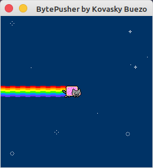
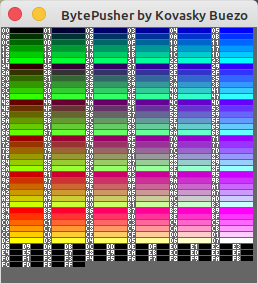

# BytePusher Virtual Machine

BytePusher Virtual Machine created in Python using Pygame and Numpy

## Description

BytePusher is a small VM with a one instruction set ByteByteJump CPU, 16 MiB RAM, 16 key keyboard (like Chip8), 256x256 Display, and 8-bit mono sampled sound. This is an implementation created in Python to get me started with the language.

You can read more about it here: https://esolangs.org/wiki/BytePusher

## Screenshots

<table>
  <tr>
    <td></td>
    <td></td>
  </tr>
</table>

## Getting Started

### Dependencies

* Python 2.7 (not tested on other versions)
* Numpy 1.16.6 (not tested on other versions)
* Pygame 1.9.6 (not tested on other versions)

Built and run Linux Mint 19.3 running Linux 5.3.0-24

### Executing program

```
python main.py romLocation
```

## To Do

* Implement Sound

## License

This project is licensed under the [GNU General Public License v3.0] License - see the LICENSE.md file for details

## Acknowledgments

* [Esolangs/BytePusher](https://esolangs.org/wiki/BytePusher)
* [Coder36](http://coder36.blogspot.com/2012/05/bytepusher.html)
* [Browser Safe Colors](http://www.ion.uillinois.edu/resources/tutorials/webdesign/WebGraphicsWorkshop/bscolors.htm)
